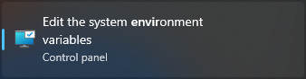
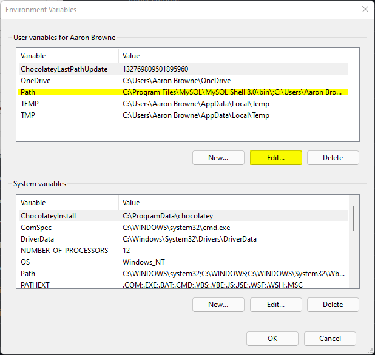

# **CustomerViewerAPI**
 This is a simple API that will allow you to Add, Delete, Modify and Get Customers from a database. This API will work with MySQL databases.

## Table of Contents
- [Creating the Database](https://github.com/browne878/CustomerViewerAPI#creating-the-database)
- [Preparing the API](https://github.com/browne878/CustomerViewerAPI#preparing-the-api)
- [Starting the API](https://github.com/browne878/CustomerViewerAPI#starting-the-api)
- [Requests](https://github.com/browne878/CustomerViewerAPI#requests)
  - [GET Request](https://github.com/browne878/CustomerViewerAPI#get-request)
  - [POST Request](https://github.com/browne878/CustomerViewerAPI#post-request)
  - [PUT Request](https://github.com/browne878/CustomerViewerAPI#put-request)
  - [DELETE Request](https://github.com/browne878/CustomerViewerAPI#delete-request)
  - [Request Parameters](https://github.com/browne878/CustomerViewerAPI-JS#request-paramaters)
- [POSTMAN Collection](https://github.com/browne878/CustomerViewerAPI#postman-collection)

## Creating the Database

**NOTE: These installation instructions are for Windows only**

- To begin with, you will need to download MongoDB Community Server. This can be done by clicking [here](https://www.mongodb.com/try/download/community).
- Run through the installation and ensure to click `Complete` installation and, optionally, you can install MongoDB Compass for a GUI.
- Next, you will need to open your C:/ drive, by default, and create a folder called `data`.
- Inside the `data` folder you just created, you will need to create another folder called `db`.
- After that, you will need to navigate to the MongoDB `bin` folder. By default, this can be found at `C:\Program Files\MongoDB\Server\5.0\bin`. This may be different fo you if you have a newer version so I suggest you go to that folder to get the path yourself.
- Once you have done that, you can then open up the start menu and search `Environment Variables`. You should then click the following option:



- Then, click the `Environment Variables` button in the bottom right.
- In the new window, select the 'Path' option in the top box and click `Edit...`.



- Next, click `New` in the top right and paste the path you retrieved earlier. You can then click okay and apply the changes.
- To check that everything worked, you can open command prompt and run the following command:
```
mongo --version
```
This should show the MongoDB version information.
- After that, you can run the following command to set up the server:
```
mongod
```
- Finally, as this database is running locally, your connection string will be:
```
mongodb://localhost/customers
```

Remember that you will need to do a POST request first to create the database

Alternatively, you can follow the steps below to import some template data to use. To do this, we will use MongoDB Compass.

- First you will want to set up the API from the steps below. You can then run it. This will create the database.
- Next you will want to open MongoDB Compass and connect to your database with the following connection string (if you left everything default):
```
mongodb://localhost/customers
```
- After that, you will want to navigate to the `customers` database and then the `customers` file.
- Then, click the green `Add Data` button and select `Import File`.
- Finally, you will want to navigate to [Customers-Database-Export.json](Customers-Database-Export.json) where you downloaded it and select it. You should also select the `JSON` button and then click the green `IMPORT` button.

Your MongoDB server should now be set up running on `localhost` on the default port of `27017` with some template data.

## Preparing the API

I will assume you have both NodeJS and npm installed for preparing the api.

- First, open command prompt and navigate to the folder you would like to download the API to. This can be done with the following command:
```
cd <directory>
```

- Next, run the following command. This will clone the repository to that folder.
```
git clone https://github.com/browne878/CustomerViewerAPI-JS
```
- After this, you will need to add an environment variable for the API to access the connection string to the database. To do this enter the command below followed by the connection string from creating the database.

Windows:
```
set conn_string=<connection-string>
```
Linux:
```
export conn_string=<connection-string>
```

### **Optional**
- If you wish to define the port used by the application (default 3000), you can do so with the following command.

Windows:
```
set PORT=<port>
```
Linux:
```
export PORT=<port>
```

You have now finished preparing the API!

## Starting the API
Once you have prepared the API, starting the application is very simple.

- First, you will need to open command prompt and navigate to the folder you placed the API in. This can be done with:
```
cd <directory>
```

- After this, all you need to do is run the following command:
```
node api.js
```

## Requests


 Once you have the API started and the database set up, all GET requests should be made to the following address.

```
https://localhost:3000/api/customers
```

### GET Request
A GET request to the following address will return an array of all the customers in JSON format.

```
https://localhost:3000/api/customers
```

Alternatively, you can select a customer by their ID as show below.

```
https://localhost:3000/api/customers/{ID}
```

### POST Request
A POST request will add a new customer to the database. A customer should be added my making a POST request to the following address with the
customer object, in JSON format, in the body of the POST.

```
https://localhost:3000/api/customers
```

### PUT Request
A PUT request will update a customers information. This can be done by making a PUT request to the following address with the customer object,
in JSON format, in the body of the PUT.

```
https://localhost:3000/api/customers/{ID}
```

### DELETE Request
A DELETE request will remove a customer from the database. This can be done by making a DELETE request to the following address with the customer ID
in the body of the DELETE.

```
https://localhost:3000/api/customers/{ID}
```

### Request Parameters

For bot POST and PUT requests there is validation on the customer objects sent in the body. The object you send must meet the following requirements.

1. First Name
  - Must be a string
  - Minimum 3 Charaters
  - Must be included in the body
2. Last Name
  - Must be a string
  - Minimum 3 Charaters
  - Must be included in the body
3. Email
  - Must be a string
  - Minimum 6 Charaters
  - Must be included in the body
4. Age
  - Must be a Number
  - Must be higher than 17

If your POST and PUT requests do not follow this you will recieve an error in the response.

## POSTMAN Collection

I have compiled a list of useful request which can be easily accessed.

You can import the collection with this [file](CustomerViewerAPI-JS.postman_collection.json).

If you wish to use my Deployed API, you can use [this](CustomerViewerAPI-JS-LIVE.postman_collection.json) collection to query it.
